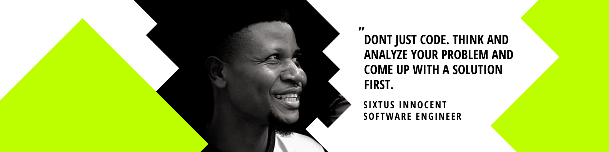

<h2>Hi I'm Sixtus Innocent! 👋</h2>

 

Software Craftsman with experience in engineering, design, and architecture; Delivering innovative business solutions for optimal performance and scalability

 

### 🛠 &nbsp;Tech Stack

#### &nbsp; Frontend

&nbsp;
&nbsp;
&nbsp;
&nbsp;
&nbsp;
&nbsp;
&nbsp;
&nbsp;
&nbsp;

#### &nbsp; Backend

&nbsp;
&nbsp;
&nbsp;

#### &nbsp; Tools

&nbsp;
&nbsp;
&nbsp;
&nbsp;
&nbsp;
&nbsp;
&nbsp;
&nbsp;
&nbsp;
&nbsp;
&nbsp;
&nbsp;

#### &nbsp; Others

&nbsp;
&nbsp;
&nbsp;
&nbsp;
&nbsp;

 

### 👀 My Stats

  
  

  <b><em>Overall GitHub Stats:</em></b>  
       

  

  
  

<!--
**sixtusDev/sixtusDev** is a ✨ _special_ ✨ repository because its `README.md` (this file) appears on your GitHub profile.

Here are some ideas to get you started:

- 🔭 I’m currently working on ...
- 🌱 I’m currently learning ...
- 👯 I’m looking to collaborate on ...
- 🤔 I’m looking for help with ...
- 💬 Ask me about ...
- 📫 How to reach me: ...
- 😄 Pronouns: ...
- ⚡ Fun fact: ...
-->
